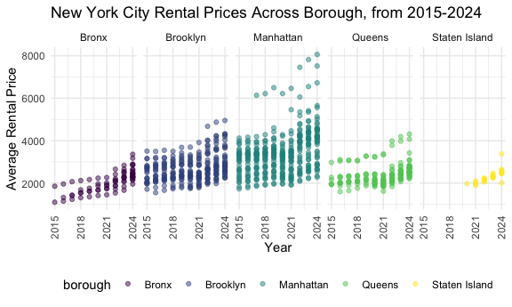
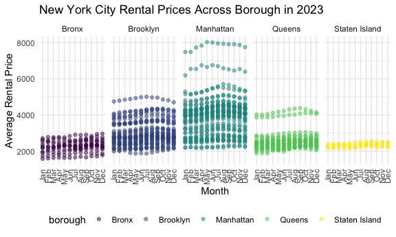

Homework 3
================
Mukta Patwari
2025-10-09

## Problem 1

Loading and inspecting data

``` r
data("instacart")
```

There are 1384617 observations in this dataset, with the following 15
variables: order_id, product_id, add_to_cart_order, reordered, user_id,
eval_set, order_number, order_dow, order_hour_of_day,
days_since_prior_order, product_name, aisle_id, department_id, aisle,
department. Some of the key variables are `order_id` and `user_id` which
give information on the individual ordering these items on Instacart.
Other key variables are `product_name`, which refers to what product(s)
the individual ordered, and `aisle` and `department` which give location
data within the grocery store.

**How many aisles are there, and which aisles are the most items ordered
from?**

``` r
instacart %>% 
  distinct(aisle) %>% 
  nrow()
```

    ## [1] 134

``` r
instacart %>% 
  group_by(aisle) %>% 
  summarize(
    n = n()
  ) %>% 
  arrange(desc(n))
```

    ## # A tibble: 134 × 2
    ##    aisle                              n
    ##    <chr>                          <int>
    ##  1 fresh vegetables              150609
    ##  2 fresh fruits                  150473
    ##  3 packaged vegetables fruits     78493
    ##  4 yogurt                         55240
    ##  5 packaged cheese                41699
    ##  6 water seltzer sparkling water  36617
    ##  7 milk                           32644
    ##  8 chips pretzels                 31269
    ##  9 soy lactosefree                26240
    ## 10 bread                          23635
    ## # ℹ 124 more rows

There are 134 different aisles in this dataset. The top 10 most
frequented aisles were: fresh vegetables, fresh fruits, packaged
vegetables/fruits, yogurt, packaged cheese, water/seltzer/sparkling
water, milk, chips/pretzels, soy/lactose free, and bread.

**Make a plot that shows the number of items ordered in each aisle,
limiting this to aisles with more than 10000 items ordered. Arrange
aisles sensibly, and organize your plot so others can read it.**

``` r
instacart %>% 
  group_by(aisle) %>% 
  summarize(
    n = n()
  ) %>%
  filter(n > 10000) %>%
  ggplot(aes(x = reorder(aisle, n), y = n)) +
  geom_point() +
  theme(axis.text.x = element_text(angle = 90, hjust = 1, vjust = 0.5)) +
  labs(
    title = "Items Ordered by Aisle (>10,000 Orders)",
    x = "Aisle Name",
    y = "Number of Items Ordered"
  )
```


This plot corroborates the results that were seen in the earlier
question, about how many items were ordered from each aisle which aisles
had the most items ordered - fresh vegetables has a high item count at
greater \>120000 orders, as does the fresh fruits category.

**Make a table showing the three most popular items in each of the
aisles “baking ingredients”, “dog food care”, and “packaged vegetables
fruits”. Include the number of times each item is ordered in your
table.**

``` r
instacart %>%
  filter(aisle %in% c("baking ingredients", "dog food care", "packaged vegetables fruits")) %>% 
  count(aisle, product_name) %>%
  group_by(aisle) %>% 
  mutate(product_rank = min_rank(desc(n))) %>% 
  filter(product_rank <= 3) %>%
  arrange(aisle, product_rank) %>%
  select(-product_rank) %>% 
  knitr::kable(digits = 2)
```

| aisle | product_name | n |
|:---|:---|---:|
| baking ingredients | Light Brown Sugar | 499 |
| baking ingredients | Pure Baking Soda | 387 |
| baking ingredients | Cane Sugar | 336 |
| dog food care | Snack Sticks Chicken & Rice Recipe Dog Treats | 30 |
| dog food care | Organix Chicken & Brown Rice Recipe | 28 |
| dog food care | Small Dog Biscuits | 26 |
| packaged vegetables fruits | Organic Baby Spinach | 9784 |
| packaged vegetables fruits | Organic Raspberries | 5546 |
| packaged vegetables fruits | Organic Blueberries | 4966 |

The table shows that in the baking ingredidents aisle, the products
light brown sugar, pure baking soda, and cane sugar were most ordered;
in the dog food care aisle, the most ordered products were “Snack Sticks
Chicken & Rice Recipe Dog Treats”, “Organix Chicken & Brown Rice Recipe”
and small dog biscuits; in the packaged vegetables fruits aisle, the
most ordered items were organic baby spinach, organic raspberries, and
organic blueberries.

**Make a table showing the mean hour of the day at which Pink Lady
Apples and Coffee Ice Cream are ordered on each day of the week; format
this table for human readers (i.e. produce a 2 x 7 table).**

``` r
instacart %>%
  mutate(order_dow = factor(order_dow, 
    levels = 0:6,
    labels = c("Sunday", "Monday", "Tuesday", "Wednesday", "Thursday", "Friday", "Saturday"))) %>% 
  filter(product_name %in% c("Pink Lady Apples", "Coffee Ice Cream")) %>%
  group_by(product_name, order_dow) %>%
  summarize(mean_hour = mean(order_hour_of_day, na.rm = TRUE)) %>% 
  pivot_wider(
    names_from = order_dow,
    values_from = mean_hour
  ) %>% 
  knitr::kable(digits = 1)
```

    ## `summarise()` has grouped output by 'product_name'. You can override using the
    ## `.groups` argument.

| product_name     | Sunday | Monday | Tuesday | Wednesday | Thursday | Friday | Saturday |
|:-----------------|-------:|-------:|--------:|----------:|---------:|-------:|---------:|
| Coffee Ice Cream |   13.8 |   14.3 |    15.4 |      15.3 |     15.2 |   12.3 |     13.8 |
| Pink Lady Apples |   13.4 |   11.4 |    11.7 |      14.2 |     11.6 |   12.8 |     11.9 |

This table shows the mean order hour of day for each day of the week
that the coffee ice cream and pink lady apples were ordered. On Sunday,
coffee ice cream was ordered at hour 13.8, which when converted to an
hour-time format, would probably be around 1:40. Similarly, the mean
hour that pink lady apples were ordered was 13.4, which would be around
1:20. The remaining columns are the days of the week Monday-Saturday,
with the corresponding mean hours for the same products ordered.

## Problem 2

Loading, importing, tidying zipcodes

``` r
zipcodes_df =
  read_csv(
    "zillow_data/Zip Codes.csv", 
    na = c("NA", ".", "")
    ) %>%
  janitor::clean_names() %>%
  filter(!(zip_code %in% c(10463, 11201) & county == "New York")) %>%
  mutate(
    borough = case_match(
      county,
      "Bronx" ~ "Bronx",
      "Kings" ~ "Brooklyn",
      "New York" ~ "Manhattan",
      "Queens" ~ "Queens",
      "Richmond" ~ "Staten Island"
    )) %>% 
  select(-state_fips, -county_code, -county_fips, -file_date, -county)
```

    ## Rows: 322 Columns: 7
    ## ── Column specification ────────────────────────────────────────────────────────
    ## Delimiter: ","
    ## chr (4): County, County Code, File Date, Neighborhood
    ## dbl (3): State FIPS, County FIPS, ZipCode
    ## 
    ## ℹ Use `spec()` to retrieve the full column specification for this data.
    ## ℹ Specify the column types or set `show_col_types = FALSE` to quiet this message.

``` r
# Duplicated zip-codes:
zipcodes_df[duplicated(zipcodes_df$zip_code),]
```

    ## # A tibble: 0 × 3
    ## # ℹ 3 variables: zip_code <dbl>, neighborhood <chr>, borough <chr>

Loading, importing, tidying rental price

``` r
rentalprice_df =
  read_csv("zillow_data/Zip_zori_uc_sfrcondomfr_sm_month_NYC.csv", na = c("NA", ".", "")) %>% 
  rename_with(janitor::make_clean_names, .cols = 1:9) %>% 
  pivot_longer(
    cols = "2015-01-31":"2024-08-31",
    names_to = "date",
    values_to = "rent",
  ) %>%
  mutate(
    date = as.Date(date)
  ) %>%
  separate(
    date, into = c("year", "month", "day"),
    convert = TRUE,
  ) %>% 
  rename(zip_code = region_name, county = county_name) %>%
  mutate(
    county = (str_remove(county, "County"))
  ) %>% 
  select(-region_id, -size_rank, -region_type, -state_name, -metro, -county)
```

    ## Rows: 149 Columns: 125
    ## ── Column specification ────────────────────────────────────────────────────────
    ## Delimiter: ","
    ## chr   (6): RegionType, StateName, State, City, Metro, CountyName
    ## dbl (119): RegionID, SizeRank, RegionName, 2015-01-31, 2015-02-28, 2015-03-3...
    ## 
    ## ℹ Use `spec()` to retrieve the full column specification for this data.
    ## ℹ Specify the column types or set `show_col_types = FALSE` to quiet this message.

Merging datasets into zillow dataframe

``` r
zillow_df =
  left_join(
    rentalprice_df, zipcodes_df, by = "zip_code"
    ) %>%
  relocate(year, month, day, state, city, borough, zip_code, neighborhood, rent)
```

**How many ZIP codes are observed 116 times? How many are observed fewer
than 10 times? Why are some ZIP codes are observed rarely and others
observed in each month?**

``` r
zillow_df %>%
  drop_na() %>% 
  group_by(zip_code) %>% 
  summarise(count = n()) %>% 
  summarise(
    sum(count == 116),
    sum(count < 10)
  )
```

    ## # A tibble: 1 × 2
    ##   `sum(count == 116)` `sum(count < 10)`
    ##                 <int>             <int>
    ## 1                  47                25

There are 47 zip codes that appear 116 times throughout the whole
dataset, and 25 zip codes that appear less than 25 times. This is likely
related to population densities and urbanization. The zip code 10001 is
distinctly in Manhattan, which is a highly urban area with many people
and large fluctuations in rental prices/unit occupancies. It is very
common for people to sign one-year leases and then not renew their
licenses, which means these units are put on the market every year. On
the other hand, a zip code like 10308, which is in Staten Island may
show up only a few times as these kinds of areas are more suburban and
resiential, and occupants may rent these places for years together
(therefore no rental prices every year).

**Create a reader-friendly table showing the average rental price in
each borough and year.**

``` r
zillow_df %>%
  group_by(borough, year) %>%
  summarize(
    mean_rent = mean(rent, na.rm = TRUE)
  ) %>% 
  pivot_wider(
    names_from = "borough",
    values_from = "mean_rent"
  ) %>% 
  knitr::kable(digits = 2)
```

    ## `summarise()` has grouped output by 'borough'. You can override using the
    ## `.groups` argument.

| year |   Bronx | Brooklyn | Manhattan |  Queens | Staten Island |
|-----:|--------:|---------:|----------:|--------:|--------------:|
| 2015 | 1759.60 |  2492.93 |   3022.04 | 2214.71 |           NaN |
| 2016 | 1520.19 |  2520.36 |   3038.82 | 2271.96 |           NaN |
| 2017 | 1543.60 |  2545.83 |   3133.85 | 2263.30 |           NaN |
| 2018 | 1639.43 |  2547.29 |   3183.70 | 2291.92 |           NaN |
| 2019 | 1705.59 |  2630.50 |   3310.41 | 2387.82 |           NaN |
| 2020 | 1811.44 |  2555.05 |   3106.52 | 2315.63 |       1977.61 |
| 2021 | 1857.78 |  2549.89 |   3136.63 | 2210.79 |       2045.43 |
| 2022 | 2054.27 |  2868.20 |   3778.37 | 2406.04 |       2147.44 |
| 2023 | 2285.46 |  3015.18 |   3932.61 | 2561.62 |       2332.93 |
| 2024 | 2496.90 |  3125.66 |   4078.44 | 2693.58 |       2536.44 |

Since 2015, there has been a general increase in rent. While the rental
price observations are unavailable in Staten Island from 2015-2019,
there is still a clear increase, especially after 2020. The highest
rental price increases occur in Manhattan, from 3022.04 dollars in 2015
to 4078.44 dollars in 2024. A more noticeable trend is how rental prices
changed during/after the pandemic, and that they increased immensely.
This is probably because people were not living in the city due to
lockdown, and to compensate, realty groups had to increase their prices
significantly due to losses.

**Make a plot showing NYC Rental Prices within ZIP codes for all
available years.**

``` r
zipcodes_price_annual = 
  zillow_df %>%
  group_by(zip_code, borough, year) %>%
  summarize(
    mean_rent = mean(rent, na.rm = TRUE)
  ) %>% 
  ggplot(aes(x = year, y = mean_rent, color = borough)) +
  geom_point(alpha = 0.5) +
  facet_grid (. ~ borough) +
  theme(axis.text.x = element_text(angle = 90, hjust = 1, vjust = 0.5)) +
  labs(
    title = "New York City Rental Prices Across Borough, from 2015-2024",
    x = "Year",
    y = "Average Rental Price"
  ) +
  scale_x_continuous(
    breaks = seq(2015, 2024, by = 3)
  )
```

    ## `summarise()` has grouped output by 'zip_code', 'borough'. You can override
    ## using the `.groups` argument.

``` r
print(zipcodes_price_annual)
```

    ## Warning: Removed 531 rows containing missing values or values outside the scale range
    ## (`geom_point()`).



This plot shows the distribution of average rental prices, for each
zip-code from 2015-2024, divided by borough. This shows that there is a
general upwards trend in zip code-level rental price from 2015-2024
across each borough, with most significant increases in Manhattan,
folowed by Queens and then Brooklyn.

**Compute the average rental price within each ZIP code over each month
in 2023. Make a reader-friendly plot showing the distribution of
ZIP-code-level rental prices across boroughs.**

``` r
zipcodes_price_2023 = 
  zillow_df %>%
  group_by(zip_code, borough, month) %>% 
  filter(year == 2023) %>%
  mutate(
    month = month.abb[(month)],
    month = factor(month, levels = month.abb)
  ) %>% 
  summarize(
    mean_rent_2023 = mean(rent, na.rm = TRUE)
  ) %>%
  ggplot(aes(x = month, y = mean_rent_2023, color = borough)) +
  geom_point(alpha = 0.5) +
  facet_grid (. ~ borough) +
  theme(axis.text.x = element_text(angle = 90, hjust = 1, vjust = 0.5)) +
  labs(
    title = "New York City Rental Prices Across Borough in 2023",
    x = "Month",
    y = "Average Rental Price"
  )
```

    ## `summarise()` has grouped output by 'zip_code', 'borough'. You can override
    ## using the `.groups` argument.

``` r
print(zipcodes_price_2023)
```

    ## Warning: Removed 333 rows containing missing values or values outside the scale range
    ## (`geom_point()`).



This plot shows the distribution of average rental prices, for each
zip-code from 2023, divided by borough. Here, the trend is relatively
stable with no large significant increases or decreases at the zip-code
level. Even in the year of 2023, Manhattan had some of the highest
average rental prices when compared to the other boroughs.

**Combine the two previous plots into a single graphic, and export this
to a results folder in your repository.**

``` r
combined_plots = zipcodes_price_annual/zipcodes_price_2023

ggsave("results/nyc_rent_comparisons.png", combined_plots, width = 12, height = 10, dpi = 300)
```

    ## Warning: Removed 531 rows containing missing values or values outside the scale range
    ## (`geom_point()`).

    ## Warning: Removed 333 rows containing missing values or values outside the scale range
    ## (`geom_point()`).

## Problem 3

Loading, tidying demographic data

``` r
demo_df =
  read_csv("nhanes_covar.csv", skip = 4) %>% 
  janitor::clean_names() %>% 
  mutate(
    sex = case_match(
      sex,
      1 ~ "male",
      2 ~ "female"
    ),
    education = case_match(
      education,
      1 ~ "Less than high school",
      2 ~ "High school equivalent",
      3 ~ "More than high school"
    ),
    education = factor(education, levels = c("Less than high school", "High school equivalent", "More than high school")),
    sex = factor(sex, levels = c("male", "female"))
  )
```

    ## Rows: 250 Columns: 5
    ## ── Column specification ────────────────────────────────────────────────────────
    ## Delimiter: ","
    ## dbl (5): SEQN, sex, age, BMI, education
    ## 
    ## ℹ Use `spec()` to retrieve the full column specification for this data.
    ## ℹ Specify the column types or set `show_col_types = FALSE` to quiet this message.

Loading, tidying accelerometer data

``` r
accel_df =
  read_csv("nhanes_accel.csv") %>% 
    janitor::clean_names()
```

    ## Rows: 250 Columns: 1441
    ## ── Column specification ────────────────────────────────────────────────────────
    ## Delimiter: ","
    ## dbl (1441): SEQN, min1, min2, min3, min4, min5, min6, min7, min8, min9, min1...
    ## 
    ## ℹ Use `spec()` to retrieve the full column specification for this data.
    ## ℹ Specify the column types or set `show_col_types = FALSE` to quiet this message.

Merging datasets

``` r
nhanes_df =
  left_join(demo_df, accel_df, by = "seqn") %>% 
  drop_na(sex, age, bmi, education) %>% 
  filter(age >= 21)
```

**Produce a reader-friendly table for the number of men and women in
each education category, and create a visualization of the age
distributions for men and women in each education category.**

``` r
nhanes_df %>% 
  group_by(sex, education) %>% 
  summarize(
    count = n()
  ) %>%
  pivot_wider(
    names_from = "education",
    values_from = "count"
  ) %>% 
  knitr::kable()
```

    ## `summarise()` has grouped output by 'sex'. You can override using the `.groups`
    ## argument.

| sex    | Less than high school | High school equivalent | More than high school |
|:-------|----------------------:|-----------------------:|----------------------:|
| male   |                    27 |                     35 |                    56 |
| female |                    28 |                     23 |                    59 |

``` r
nhanes_df %>% 
  group_by(sex, education) %>% 
  ggplot(aes(x = age, fill = sex)) +
  geom_density(alpha = 0.5) +
  facet_grid(. ~ education) +
  labs(
    title = "Distribution of Age by Sex per Education Category"
  )
```


The table depicts how education levels are different according to sex.
Namely, the `more than high school` category had more participants,
regardless of sex, although there are just 3 more women comparatively.
In the `less than high school` category, the number of men and number of
women are almost identical; there are 27 men and 28 women. The “largest”
difference is seen in the `high school equivalent`category, where there
are 12 more men than women.

The density plots show the age distributions for these participants,
divided by both sex and education category. For those in the
`less than high school category`, the densities largely overlap, with
most participants in this category ranging between ~40-70 years. There
are not as many participants between the ages of 20-40. In the
`high school equivalent` category, the distribution for men peaks at
around 20-40 years and then again at 60 years, while for women it peaks
at around 75-80 years. This indicates that this category has more older
women and relatively younger men, and there is less overlap. In the
`more than high school` category, the distributions overlap again, with
peaks between 20-40 years.Importantly, the density for women is much
higher than that of men, indicating that there are more women with
higher education in this group than there are men. For this group, there
are remarkably less participants at older ages.

**Using your tidied dataset, aggregate across minutes to create a total
activity variable for each participant. Plot these total activities
(y-axis) against age (x-axis); your plot should compare men to women and
have separate panels for each education level. Include a trend line or a
smooth to illustrate differences.**

``` r
nhanes_df = nhanes_df %>% 
  pivot_longer(
    cols = starts_with("min"),
    names_to = "minutes",
    values_to = "mims_value"
  ) 

nhanes_df %>% 
  group_by(seqn, age, sex, education) %>% 
  summarize(
    total_activity = sum(mims_value)
  ) %>%
  ggplot(aes(x = age, y = total_activity, color = sex)) +
  geom_point(alpha = 0.5) +
  geom_smooth(se = FALSE) +
  facet_grid(. ~ education) +
  labs(
    title = "Total activity per day by age and educational level",
    x = "Age",
    y = "Total Activity per day"
  )
```

    ## `summarise()` has grouped output by 'seqn', 'age', 'sex'. You can override
    ## using the `.groups` argument.
    ## `geom_smooth()` using method = 'loess' and formula = 'y ~ x'


This plot displays age distributions for total activity per day across
each educational level, divided by sex. For those in the
`less than high school` category, there is an overall decline in total
activity as age increases, with slight peaks at age 60. Total activity
is higher for women at age 20 than it is for men, and at age 40 this
relationship reverses and men consistently have higher total activity
numbers. For those in the `high school equivalent` category, the age
distribution for women peaks at 40 years and 70 years, while for men it
peaks only at 40. Generally, women have higher total activity for all
ages when compared to men, except for at 80 years when they level off.
For those in the `more than high school` category, there are less
obvious peaks and aprubt changes, but there is still a declining trend
from 20 years to 80 years. Similar to the `high school equivalent`
category, women generally have higher total activity when compared to
men. Based on these observations, I would conclude that high school
education or more increases total activity in women when compared to
men, and that it is highest at 20-40 years before leveling off between
60-80 years.

**Make a three-panel plot that shows the 24-hour activity time courses
for each education level and use color to indicate sex.**

``` r
nhanes_df %>% 
  group_by(minutes, sex, education) %>% 
  summarize(
    total_activity = sum(mims_value)
  ) %>% 
  ggplot(aes(x = minutes, y = total_activity, color = sex)) +
  geom_smooth(aes(group = sex), se = FALSE) +
  facet_grid(. ~ education) +
  labs(
    title = "Per day activity-time course by sex and education level",
    x = "Minutes",
    y = "Total activity per day"
  )
```

    ## `summarise()` has grouped output by 'minutes', 'sex'. You can override using
    ## the `.groups` argument.
    ## `geom_smooth()` using method = 'gam' and formula = 'y ~ s(x, bs = "cs")'


